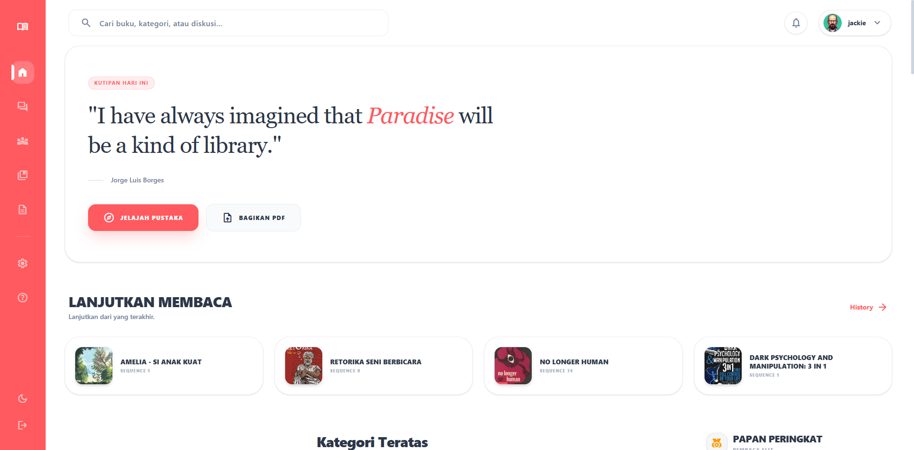
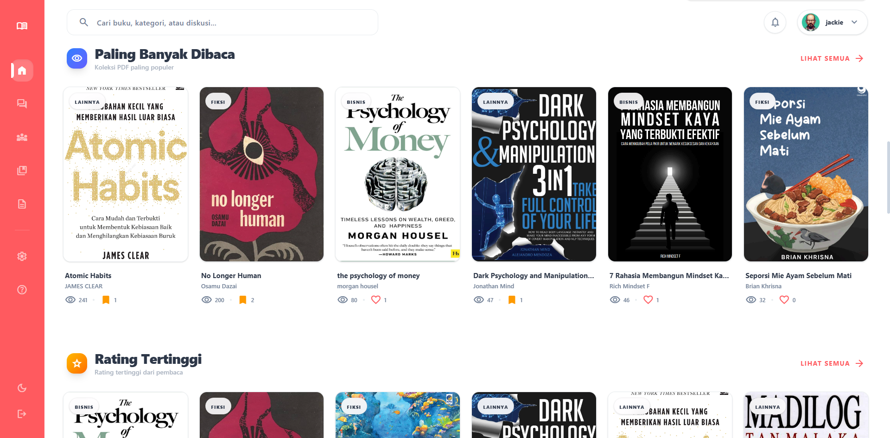
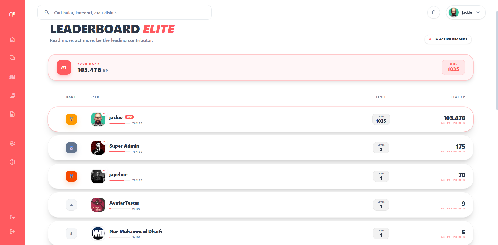

# 📚 Book-In: Digital PDF Library & AI Reader

<div align="center">
  
  
  
  
  
</div>

<br/>

**Book-In (Perpustakaan PDF)** adalah platform perpustakaan digital modern yang dirancang untuk mengelola, membaca, dan berinteraksi dengan dokumen PDF secara mudah dan cepat. Dibangun dengan fokus pada kecepatan, kemudahan antarmuka, serta dilengkapi dengan fitur *Artificial Intelligence* (AI) untuk meningkatkan pengalaman membaca Anda.

---

## 📸 Tampilan Layar (Screenshots)

<p align="center">
  
  
</p>
<p align="center">
  
  
</p>

---

## ✨ Fitur Utama (Key Features)

- **📖 Interactive PDF Reader**: Pengalaman membaca PDF berkinerja tinggi menggunakan `react-pdf` dengan antarmuka dinamis.
- **🤖 AI Integration**: Terintegrasi dengan OpenRouter AI untuk analisis dokumen cerdas dan asisten interaktif.
- **🛡️ Admin Dashboard**: Sistem manajemen yang lengkap bagi admin untuk mengelola pengguna, buku, kategori, dan interaksi komunitas.
- **💬 Community Forum**: Platform diskusi *engaging* dengan dukungan *Rich Text Editor* (Tiptap).
- **🔍 Advanced Search & Filter**: Pencarian *real-time* dan sistem kategorisasi agar buku mudah ditemukan.
- **📱 Responsive Design**: Optimal digunakan pada layar Desktop, Tablet, maupun Smartphone.
- **🌙 Dark/Light Theme**: Dukungan penuh untuk pergantian warna mode gelap dan terang.
- **🖼️ OCR Capabilities**: Ekstraksi teks dari gambar atau sampul PDF otomatis menggunakan Tesseract.js.

## 🛠️ Teknologi yang Digunakan (Tech Stack)

- **Framework**: [Next.js 15 (App Router)](https://nextjs.org/)
- **Bahasa Pemrograman**: [TypeScript](https://www.typescriptlang.org/)
- **Styling**: [Tailwind CSS v4](https://tailwindcss.com/) & Framer Motion
- **Database**: SQLite lokal dengan [Prisma ORM](https://www.prisma.io/)
- **Autentikasi**: JWT-*based secure auth* (menggunakan library Jose & Bcryptjs)
- **Editor Teks**: Tiptap (Rich Text Editor)
- **Layanan AI**: Akses melalui OpenRouter API
- **Utilities**: Zod (Validasi Cepat), Date-fns (Manajemen Tanggal), Nodemailer (Layanan Email)

## 🚀 Panduan Instalasi (Getting Started)

### Prasyarat (Prerequisites)
Pastikan Anda sudah menginstal perangkat lunak berikut:
- Node.js versi 18 atau ke atas
- NPM / PNPM / Yarn
- Git

### Langkah Instalasi Lokal

1. **Klon repository ini**:
   ```bash
   git clone <repository-url>
   cd Perpustakaan-PDF
   ```

2. **Instal seluruh dependensi**:
   ```bash
   npm install
   ```

3. **Atur konfiguasi Environment Variables (`.env`)**:
   Buat file `.env` di *root* direktori project Anda, lalu salin dan sesuaikan isinya:
   ```env
   # Database Configuration (Wajib)
   DATABASE_URL="file:./prisma/dev.db"
   
   # Security JWT (Wajib ganti dengan string acak)
   JWT_SECRET="your-super-secret-key"
   
   # AI Integration (Opsional untuk asisten AI)
   OPENROUTER_API_KEY="your-openrouter-api-key"
   ```

4. **Inisialisasi Database**:
   Melakukan integrasi skema database ke SQLite:
   ```bash
   npx prisma generate
   npx prisma db push
   ```

   *(Opsional)* Jalankan proses *seeding* jika ingin mengisi database dengan kategori awal bawaan:
   ```bash
   npm run prisma:seed
   ```

5. **Nyalakan Development Server**:
   ```bash
   npm run dev
   ```
   Aplikasi Anda siap diakses melalui [http://localhost:3000](http://localhost:3000).

---

## 🔐 Akses Super Admin (Super Admin Setup)

Setelah aplikasi berjalan, buka tautan berikut melalui browser Anda untuk mencetak atau me-reset akun Super Admin:
👉 `http://localhost:3000/api/seed`

**Kredensial Login Default Admin:**
- **Email**: `admin@bookin.com`
- **Password**: `admin123`

*(Catatan: Direkomendasikan untuk segera memperbarui password setelah login pertama kali di lingkungan produksi).*

## 📁 Struktur Projek (Clean Architecture)

Aplikasi ini sudah dioptimasi dari file-file sampah (*Clean Repository*) sehingga sangat ringan dan *developer-friendly*:

- `src/app/` — Seluruh halaman aplikasi (Routing) dan API internal Next.js.
- `src/components/` — Modul komponen kerangka antarmuka pengguna (UI) yang dirancang agar *reusable*.
- `src/lib/` — Berisi *core utilities*, konfigurasi autentikasi, klien Prisma, dan integrasi API luar.
- `src/context/` — Tempat pengelolaan *Global State* dan konfigurasi bahasa.
- `prisma/` — Direktori penyimpanan skema database utama (`schema.prisma`) dan berkas database dev.
- `public/` — Kumpulan Asset publik statis seperti *Icon*, ekstensi teks, dan letak penyimpanan unggahan buku.

---

<div align="center">
  <p>Diformat ulang dan disederhanakan tanpa Docker/Ngrok agar sangat praktis untuk dikembangkan secara individual.</p>
  <i>Built with ❤️ for the PDF Reading Community.</i>
</div>
